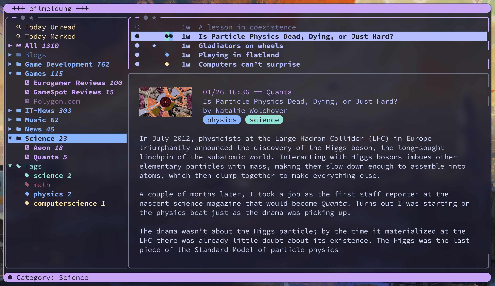

This is still **WIP**!

 


  

 

*eilmeldung* is a *TUI RSS reader* based on the awesome [news-flash](https://gitlab.com/news-flash/news_flash) library.  
- *fast* in every aspect: non-blocking terminal user interface, (neo)vim-inspired keybindings, instant start-up and no clutter
- *stands* on the shoulder of *giants*: based on the news-flash library, *eilmeldung* supports many RSS providers, is efficient and reliable
- *powerful* and yet *easy to use out-of-the-box*: sane defaults which work for most, and yet configurable to meet anyones requirements, from keybindings to colors, from displayed content to RSS provider
- read news like a pro: filter and search news with a easy-to-learn powerful *query language*, activate *zen mode* to focus on the article content and nothing else

*eilmeldung* is German for *breaking news*

# Features at a Glance

## Setup and Basic Workflow

<https://github.com/user-attachments/assets/fde789bf-a80c-4b1d-800c-d2d305cf68a0>

# Installation 

Follow any of the installation methods below, then run *eilmeldung*. It will guide you through the setup process.

## Important: Nerd Fonts

You need a [Nerd Font](https://github.com/ryanoasis/nerd-fonts) compatible font/terminal for icons to display correctly!

## Via Homebrew

To install via [homebrew](https://brew.sh), tap this repository and install *eilmeldung*:

```bash
brew tap christo-auer/eilmeldung https://github.com/christo-auer/eilmeldung
brew install eilmeldung
```

## Via Cargo

In order to compile `eilmeldung` from source, you need `cargo` with a `rust` compiler with at least edition 2024 (e.g., use `rustup`) and some build deps. On Debian/Unbuntu-based systems its:

```bash
apt update
apt install --yes sudo apt-get install -y build-essential libssl-dev pkg-config libxml2-dev clang libsqlite3-dev

```

Then install *eilmeldung* via:

```
cargo install --git https://github.com/christo-auer/eilmeldung
```


## Nix Flake and Home Manager

<details>
<summary> Expand for installation on Nix and Home Manager</summary>

  Add *eilmeldung* to your inputs, apply `eilmeldung.overlays.default` overlay to `pkgs`. If you want Home Manager integration, add Home Manager module `eilmeldung.homeManager.default`. Here is an example:

  ```nix
  {
    inputs = {
      // ...
      eilmeldung.url = "github:christ-auer/eilmeldung";
    };

    outputs = { nixpkgs, home-manager, eilmeldung, ... }: {
      homeConfigurations."..." = home-manager.lib.homeManagerConfiguration {
        pkgs = import nixpkgs {
          system = "x86_64-linux";
          overlays = [ eilmeldung.overlays.default ];
        };
        
        modules = [
          // ...
          eilmeldung.homeManagerModules.default
        ];
      };
    };
  }
  ```

Home Manager configuration works by defining the settings from the configuration file:

```nix
programs.eilmeldung = {
  enable = true;

  settings = {
    refresh_fps = 60;
    article_scope = "unread";


    theme = {
      color_palette = {
        background = "#1e1e2e";
        // ...
      };
    };

    input_config.mappings = {
        "q" = "quit";
        "j" = "down";
        "k" = "up";
        "g g" = "gotofirst";
        "G" = "gotolast";
        "o" = ["open" "read" "nextunread"];
    };

    feed_list = [
      "query: \"Today Unread\" today unread"
      "query: \"Today Marked\" today marked"
      "feeds"
      "* categories"
      "tags"
    ];
  };
};


```

</details>


# Documentation

- [Configuration](docs/configuration.md): contains all *configuration options* along with the input configuration
- [Commands](docs/commands.md): *eilmeldung* contains a command line, like (neo)vim, to effectively carry out many operations (e.g., bulk-operations)
- [Article Queries](docs/queries.md): *article queries* can be used to *filter* and *search* according to a multitude of search criteria. Article queries are also supported by bulk-operations (un/tag, un/read, un/mark articles)
- [Command Line Argumnets](docs/cli_args.md): available command line arguments


</details>

# Standing on the Shoulders of Giants

*eilmeldung* was inspired by other awesome programs and libraries of which I want to mention some:

- [news-flash](https://gitlab.com/news-flash/news_flash) library and [news-flash GTK](https://gitlab.com/news-flash/news_flash_gtk), a modern Gnome/GTK RSS reader, both implemented in rust
- [newsboat](https://newsboat.org/) which has been me TUI RSS reader of choice for many years
- [spotify-player](https://github.com/aome510/spotify-player), a TUI spotify music player written in rust. In particular, the theming system and how input is handled has been a great inspiration for *eilmeldung*
- [vifm](https://vifm.info/), [neomutt](https://neomutt.org/) with [notmuch](https://notmuchmail.org/) inspired the filtering and article query systems
- [neovim](https://neovim.io/) and [vim](https://www.vim.org/) for their philosophy on user input
- [ratatui](https://ratatui.rs/) and all its supporting libraries for creating the TUI

# On the use of AI in this Project 

TODO
