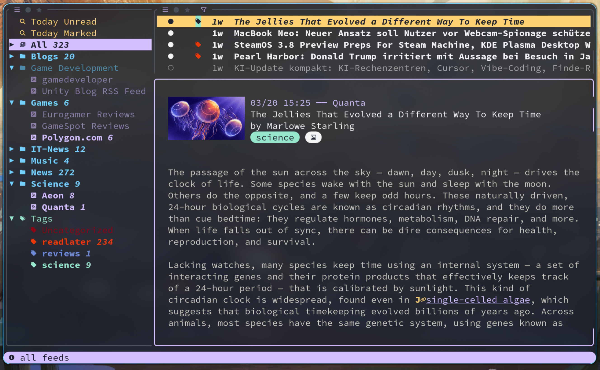

# Learning rust through an LLM to develop eilmeldung (and what I tell my students) 

This document explains why and how LLMs were used in the development of [eilmeldung](https://github.com/christo-auer/eilmeldung), and shares lessons learned from this experiment in learning Rust through LLM assistance. Here is the end result:

 

eilmeldung was built as an experiment in learning Rust through LLM use.

## Some Context from My work as a Teacher

I teach programming/computer science at a university of applied sciences. Over the last few years, I've witnessed a change in how students *learn* and *understand* programming and related concepts by using LLMs. While for some students, using LLMs brings real benefits, for others it becomes a crutch that prevents genuine learning. The difference lies not in the tool itself, but in *how* it's used. I am not only talking about *cheating* in assignments. The main problems are in my opinion:

1. LLMs are trained to produce code and solve problems: when a student encounters a problem, LLMs tend to produce code, preventing students from overcoming the challenge themselves and robbing them of a vital learning opportunity.
2. As LLMs tend to be sycophantic and pleasing in the nature of their answers, students fall into the trap of believing that they understood the concept under investigation. This may be true on a conceptual level. However, programming is a *doing art* which is only understood when students overcome the challenge of *applying a programming concept* (by failing and then succeeding).

Consider this analogy I sometimes use with my students: You want to learn to swim. An LLM can explain the mechanics—how to move your arms, when to breathe, how to stay afloat. But would you then jump into deep water based solely on that explanation? Of course not. You'd need hours of practice in shallow water, struggling, failing, and gradually improving.

Programming is no different. Yet LLMs make it tempting to skip the struggle entirely. To be fair, the same argument applies to any passive learning method (like YouTube videos or classical lectures). However, never has this approach of purely conceptual learning been so alluring as with LLMs.

That said, LLMs, it seems at the moment, are here to stay. Knowing how to use them (and when not) is a vital ability which already plays a certain role in programming. For this reason I am incorporating "developing using LLMs" into my programming course ("Advanced topics in Java"). In order to make sure to really understand what I am talking about, I needed to apply LLMs to *learn a new programming language* myself. And this project *eilmeldung* is the result of this endeavour.

## Using an LLM as a Tutor

Using the right prompt is key for using an LLM as a tutor. I am using this [tutor.md](https://github.com/user-attachments/files/24354660/tutor.md) in [opencode](https://opencode.ai/) which basically states among other this (slightly altered excerpt):

- assess prior knowledge
- guide learning through thoughtful *questions* rather than *direct answers*
- build complex concepts from simpler foundations
- encourage hands-on exploration and experimentation

### Assessing Prior Knowledge

The LLM starts with assessing prior knowledge by asking me: "How confident are you on the topic of lifetimes/this API/ etc. in rust?" I can either give a direct answer or point it to a prior project of mine to assess my abilities. Here is an example from another project I am currently starting:

Prompt
> Me:
> I want to implement a rust library for accessing octoprint: https://docs.octoprint.org/en/main/api/
> I want to learn how to idiomatically implement such a library:
> - are there any "standard patterns" to do this
> - are there maybe already rust crates which can be used to more easily implement clients for REST apis, e.g., using macros. what comes to mind are serde, tokio (for async), reqwest, etc.

Using the tutor prompt from above I got (among other things):

> LLM: Before we write any code together, I want to understand where you want to go and what you already know:
> 1. How comfortable are you with Rust's async/await and ownership model? (This shapes how we introduce reqwest and tokio)
> ...

My answer was: *have a look at eilmeldung* and judge yourself. The LLM proceeded to assess my abilities and we started with the project.

As with teaching in real-life, people have different prior knowledge. Starting with the right context is crucial to avoid wasting time and overburdening.

### The LLM is Prompting Me to Think: The Conceptual Back-and-Forth

An interesting observation with this approach is how the LLM starts to *prompt me* instead of *me prompting the LLM*. Here is an example again from the OctoPrint REST API about deserializing return values through generics:

> LLM: One more consideration: some endpoints return 204 No Content with no body — like POST /api/logout. A generic get<T> can't handle those. 
> How would you deal with that? Would you have a separate helper for no-body responses, or handle it differently?

Note how it didn't propose a direct answer or produced any code. It pointed me to a problem with my approach and asked me about my ideas. This process continues like this:

- LLM asks me how to approach a certain aspect
- I propose a solution (still no coding at this point)
- LLM points me to things that are good and things that may be improved
- repeat with step one or start implementing

Here is another example about how to implement the error interface of my API:

> LLM: For the Error enum, we need to decide: should we expose reqwest::Error directly in our public API, or wrap it?
> Consider this trade-off:
> - Exposing it directly (#[from] reqwest::Error) is simple, but it leaks your HTTP client choice into your public API. If you ever swap reqwest for hyper directly, it's a breaking change.
> - Wrapping it (a Network(String) variant or a newtype) hides the dependency but loses information.
> What's your instinct here — and does the fact that this is a library (not an app like eilmeldung) change your answer?

Note: There is no implied right or wrong here (even though you may feel strongly about either of these approaches). Triggering a discussion and a thought process is the aim. It is the starting point of learning. Even if you choose the "wrong path" in the end.

### Producing Actual Code: The Practical Back-and-Forth

After enough theoretical back-and-forth, the LLMs asks to actually implement something; to jump into cold water. This is the practical back-and-forth, for instance:

> LLM: Ready to write some actual code? Let's start with error.rs — back to the question I left you with: what's your sketch of the Error enum?

Then I write my first draft for `error.rs` and I ask it to have a look (shortened):

> LLM:
> Good start! The structure is exactly right — all four failure modes are there. A few observations and questions:
> What's Good: *tells me what's good*
> Things Worth Refining: *points out what can be improved or is actually conceptionally wrong*
> Have a go at revising error.rs with these thoughts!

And the loop starts again. Step by step we refine everything until we can move to a different part.

### Pushing Back and Embracing LLM Shortcomings

LLMs can be *wrong*. Sometimes it is good to push back. Here is an example from when I wanted to learn how to implement an iterator (which is used for generating URL hints in eilmeldung):

> Me: I want to learn to implement an rust iterator: *description of what I want to achieve*

It pointed out a "subtle error" on the first element my iterator produces. I pushed back and got:

> you're absolutely right to push back on me — the length is monotonically increasing! I was overcomplicating it. Your original intuition was correct: *explains why I am awesome*

In this particular case I was actually right and the LLM dead-wrong (*take that!*). 

However, an LLM saying that you are *absolutely right* doesn't mean that you are actually right. This is the typical double-catch you encounter due to its sycophantic behavior. So how can I tell when I am right or when the LLM is right? The answer is: you can't! For an inexperienced learner this is bad news, right? No, I don't think so. Students should *embrace this behavior*: go with the instinct or a your first gut feeling and when, later on, things fall apart and you *see* why you (or the LLM) was wrong then, well, then you have actually *learned* something.

On this topic, I had a "discussion" about using macros in a certain situation: I defined a macro for implementing several methods and the LLM told me its overkill. I pushed back and said I want to keep it and see if this approach scales. The LLM actually put it well:

> Fair enough — learning by pushing an idea to its limits is a valid approach. You'll feel exactly where it breaks down rather than just being told. 

Later on, I will probably ditch the macro. But then I know why I had to ditch it. Or I keep it. I'll see.

### Limits

There are certain limits of this approach:

- as stated above: LLMs make errors and sometimes its hard to spot them
- context rot: with increasing project size and chat history (making up the context), quality of responses decreases. Create new sessions for different sub-problems to avoid this.
- current LLMs are trained to *solve (coding-)problems* and not to teach the user. Sometimes, even with my tutor prompt, the LLM reverted to this behavior and solved the problem directly (even if I told it not to do this). Starting a new session usually helps. Also larger models tend to behave more reliable in this regard.

### Conclusion

Learning with an LLM is not that dissimilar to learning with a tutor besides you. I kind of now understand how my students feel when I am sitting besides them, giving suggestions and asking questions. There is a fine line here between:

- actually teaching by letting the student make mistakes and learn from them
- giving away the solution, even robbing the student from the opportunity to make a mistake

In my classes I usually tell my students that I like *wrong answers* to a question better than *correct answers*. There is a multitude of ways to something wrong but usually only a few ways to do something right. This is true for the students as it is for LLMs (or human tutors). Embrace the ambiguity and the failure!

### Key Takeaway 

If you're learning with LLMs:
- **Do**: Use them as tutors that ask questions, not answer machines
- **Do**: Implement solutions yourself, even when LLMs offer code
- **Do**: Embrace the ambiguity of not knowing if the LLM or you made the right decision
- **Don't**: Let LLMs rob you of the struggle --- the struggle *is* the learning
- **Don't**: Mistake understanding an explanation for having the skill

### What I Tell my Students

In my advanced programming course on Java I have introduced a whole chapter about AI-assisted programming, basically telling them the same as explained here. Using an LLM as a tutor is a part of this (among other parts like writing tests). You can find the German lecture material [here](https://if-portal.haw-landshut.de/public/auer/IB315/ProgrammierenIII.zip). In the [first exercise](https://if-portal.haw-landshut.de/public/auer/IB315/Praktikum-1-Vibe-Coding.zip) they *have* to vibe-code a simple application.

So far this has been received well by the students. Though, I shy away from giving a final verdict as I've given this modified lecture only once so far and technology develops still very fast.

## Some Other Purely Anecdotal Lessons Learned

- **Using an LLM as a tutor was mostly successful**. For example, when debugging borrow checker errors, having the LLM *ask* me questions like "What is the lifetime of this reference?" was far more educational than receiving a corrected code snippet. However, as the context becomes longer, LLMs tend to forget their role as tutors (*context rot*) and start to produce code again. Apart from that, LLMs *can* be really good sparring partners when it comes to learning.
- **Explaining unknown code bases works relatively well** as long as the code base is not too large and questions are either very specific or very high-level.
- **Creating documentation works but needs to be checked *very carefully*** for errors and wrong assumptions.
- **Refactoring (in my case) didn't work** and I had to revert the changes: LLMs tend to produce code which is not very maintainable and does not fit to the existing architecture.
- **Committing worked well at first but led to data loss in one case** (LLM stashed all changes, then dropped the stash and then tried to re-implement the changes itself)

## How LLMs were used in eilmeldung

LLMs were used in this project to understand if and how they can be used for the following:

- **Learning a new programming language or concept using a *Tutor Agent Prompt***: The tutor agent prompt tells the LLM to *not produce any solutions* or *code*. Instead, the LLM was prompted to lead me to a solution by asking questions. This approach was applied also to compiler errors.
- **Explaining existing code bases using a *Explainer Agent Prompt***: With this prompt, the LLM explains existing code bases to more quickly understand *idiomatic programming approaches* and *architectures*.
- **Creating documentation** (e.g., [Commands](commands.md))
- **Refactoring after a certain pattern**: After refactoring one or more modules, the LLM was asked to refactor remaining modules in a similar manner.
- **Creating fine-grained commits**.

---

## How LLMs were NOT used in this Project

This project is **not vibe-coded**. Every line was intentionally written to solve a problem I understood. The code has *warts*, i.e., awkward Rust patterns, over-engineered solutions, remnants of learning mistakes --- and that's the point. This is what *learning* looks like.

---

## Tools and Prompts

I am using [neovim](https://neovim.io/) with [opencode](https://opencode.ai/). Here are the prompts in *opencode agent format* I've developed for the different tasks:

- [tutor.md](https://github.com/user-attachments/files/24354660/tutor.md): Tutor helping to understand new concepts
- [explainer.md](https://github.com/user-attachments/files/24354664/explainer.md): For understanding code bases
- [unit-tester.md](https://github.com/user-attachments/files/24354665/unit-tester.md): For creating unit tests. Note how the LLM should **deny** creating tests on implementations or unclear specification.

